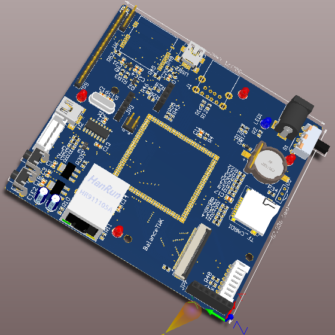

# candy-box

| 项目 | 参数 | 附加说明 |
|:---|:---|:---|
| CPU | MIMIXRT1052CVL5B | 核心板资源 |
| SDRAM | 32MB | 核心板资源 |
| NOR FLASH | 32MB | 核心板资源 |
| EEPROM | 2kb (I2C3) | 核心板资源 |
| Ethernet | LAN8720AI | 核心板资源 |
| WIFI | RTL8710BN/X (SPI3) | 802.11 b/g/n |
| LCD | RGB565 | 板载接口 |
| USB | 2个 | USB2 支持 OTG |
| USB 转串口 | UART1 | 用于 FinSH 组件输出 |
| humiture | DHT12 (I2C3) |  |
| TF_CARD | SDIO1 |  |
| Lidar | UART5 | 板载接口 |
| DC-DC | 5V 1-2A | 输入 5V |
| SWD | SWDIO/SWCLK | DEBUG MODE |

